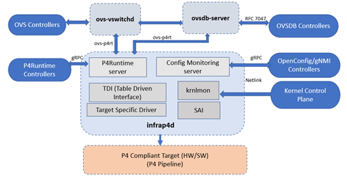
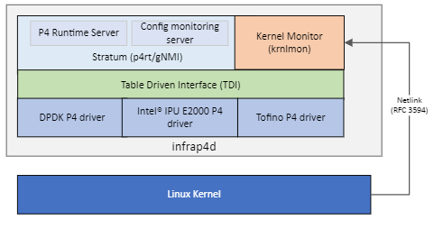

# IPDK Networking Recipe (P4 Control Plane)

## Overview

The IPDK Networking Recipe (previously P4-OVS Split Architecture)
modularizes P4-OVS and reduces coupling between its components, making the
code easier to maintain and more suitable for upstreaming. It moves the
P4-specific components of the integrated architecture of P4-OVS to a separate
process called infrap4d.



## infrap4d

Infrap4d integrates Stratum, the Kernel Monitor (krnlmon), Switch Abstraction
Interface (SAI), Table Driven Interface (TDI), and a P4 target driver into a
separate process (daemon).



## Stratum

Stratum is an open-source silicon-independent switch operating system.
It is a component of Infrap4d that provides the P4Runtime and gNMI/Openconfig
capabilities for P4 flow rule offloads and port configuration offloads.
Stratum is augmented with a new tdi platform layer that processes P4rt and
gNMI requests and interacts with the underlying P4 target driver through TDI.
A new ipdk platform layer provides IPDK-specific replacements for several
TDI modules that allow it to handle configuration differences between IPUs
and the switches for which Stratum was developed.

## Table Driven Interface (TDI)

TDI (Table Driven Interface) provides a target-agnostic interface to the
driver for a P4-programmable device. It is a set of APIs that enable
configuration and management of P4 programmable and fixed functions of a
backend device in a uniform and dynamic way. Different targets like bmv2
and P4-DPDK can choose to implement their own backends for different P4
and non-P4 objects but can share a common TDI. Stratum talks to the
target-specific driver through the TDI front-end interface.

## Kernel Monitor (krnlmon)

The Kernel Monitor receives RFC 3549 messages from the Linux Kernel over a
Netlink socket when changes are made to the kernel networking data structures.
It listens for network events (link, address, neighbor, route, tunnel, etc.)
and issues calls to update the P4 tables via SAI and TDI. The kernel monitor
is an optional component of infrap4d.

## Switch Abstraction Interface (SAI)

The Switch Abstraction Interface (SAI) defines a vendor-independent interface
for switching ASICs.

## Interfaces

### P4Runtime

The P4Runtime API is a control plane specification for managing the
data plane elements of a device defined or described by a P4 program.

### gNMI

gRPC Network Management Interface (gNMI) is a gRPC-based protocol to manage
network devices.

## Clients

### ovs-p4rt

A library (C++ with a C interface) that allows ovs-vswitchd and ovsdb-server
to communicate with the P4Runtime Server in infrap4d via gRPC. It is used to
program (insert/modify/delete) P4 forwarding tables in the pipeline.

### p4rt-ctl

A Python-based P4Runtime client which talks to the P4Runtime Server in
infrap4d via gRPC, to program the P4 pipeline and insert/delete P4 table
entries.

### gnmi_cli

A gRPC-based C++ network management interface client to handle port
configurations and program fixed functions in the P4 pipeline. Included
when the P4 Control Plane is built for the Tofino target.

### gnmi-ctl

A version of `gnmi_cli` that has beeen customized for use with `infrap4d`.
Included when the P4 Control Plane is built for the DPDK target.

## Download

To download the source code for the Networking Recipe:

```bash
git clone --recursive https://github.com/ipdk-io/networking-recipe
```

For the Intel Tofino and IPU E2000 ASICs, you will need to obtain the
P4 driver packages from the manufacturer.

## Targets

The IPDK Networking Recipe can be built to support different targets.
See the target-specific instructions for information on how to set up,
build, and use a particular target.

| Target | Instructions |
| ------ | ------------ |
| dpdk   | [IPDK Networking Recipe for DPDK](https://github.com/ipdk-io/networking-recipe/blob/main/docs/ipdk-dpdk.md) |
| es2k   | _to be provided_ |
| tofino | [IPDK Networking Recipe for Tofino](https://github.com/ipdk-io/networking-recipe/blob/main/docs/ipdk-tofino.md) |
