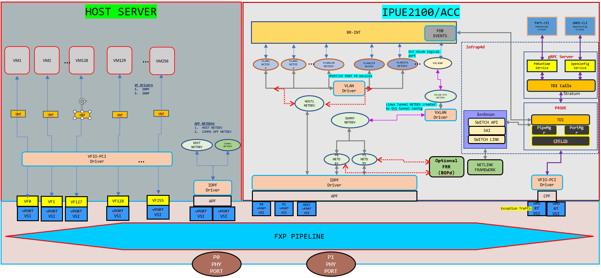

# Linux Networking with LAG (ES2K)

This document explains how to run the Linux networking scenario with LAG (Link Aggregation Group) on ES2K.

## Topology



Notes about topology:

- Four Kernel netdevs are created by default by loading IDPF driver during ACC bring-up. You can also create more than four netdevs. For that, we need to modify the `acc_apf` parameter under `num_default_vport` in `/etc/dpcp/cfg/cp_init.cfg` on IMC before starting `run_default_init_app`.
- In `/etc/dpcp/cfg/cp_init.cfg`, also change the default `sem_num_pages` to the value specified in `/opt/p4/p4sde/share/mev_reference_p4_files/linux_networking/README_P4_CP_NWS`.
- In `/etc/dpcp/cfg/cp_init.cfg`, also modify the default `allow_change_mac_address` value to true.
- vlan1, vlan2, .... vlanN created using Linux commands and are on top of an IDPF Netdev. These VLAN ports should be equal to number of VMs that are spawned.
- br-int and the VxLAN ports are created using the ovs-vsctl command. The VxLAN ports are attached to br-int using ovs-vsctl command.
- Both physical ports P0 and P1 should be B2B connected to the Link Partner device and LAG should be configured on both the devices with the associated ports as LAG members using ip link command.

System under test will have the above topology running the networking recipe. Link Partner can have the networking recipe or legacy OvS or kernel VxLAN. See the [Limitations](#limitations) section before setting up the topology.

## Create P4 artifacts and start Infrap4d process

Use the Linux networking P4 program present in the `/opt/p4/p4sde/share/mev_reference_p4_files/linux_networking` directory for this scenario.
See [Running Infrap4d on Intel IPU E2100](/guides/es2k/running-infrap4d) for instructions on compiling the P4 program, bringing up  the ACC, and running `infrap4d` on the ACC.

## Create the topology

The p4rt-ctl and ovs-vsctl utilities can be found in $P4CP_INSTALL/bin.

### Set the forwarding pipeline

Once the application is started, set the forwarding pipeline config using the P4Runtime Client (`p4rt-ctl`) set-pipe command:

```bash
$P4CP_INSTALL/bin/p4rt-ctl set-pipe br0 $OUTPUT_DIR/linux_networking.pb.bin \
    $OUTPUT_DIR/linux_networking.p4info.txt
```

`linux_networking.pb.bin` and `linux_networking.p4info.txt` were created, along with other artifacts, when the P4 program was compiled.

### Configure VSI group and add a netdev

Use one of the IDPF netdevs on ACC to receive all control packets from overlay
VMs by assigning to a VSI group. VSI group 3 is dedicated for this configuration,
execute below devmem commands on IMC.

```bash
# SEM_DIRECT_MAP_PGEN_CTRL: LSB 11-bit is for vsi which need to map into vsig
devmem 0x20292002a0 64 0x8000050000000008

# SEM_DIRECT_MAP_PGEN_DATA_VSI_GROUP : This will set vsi
# (set in SEM_DIRECT_MAP_PGEN_CTRL register LSB) into VSIG-3
devmem 0x2029200388 64 0x3

# SEM_DIRECT_MAP_PGEN_CTRL: LSB 11-bit is for vsi which need to map into vsig
devmem 0x20292002a0 64 0xA000050000000008
```

Note: Here VSI 8 has been used for receiving all control packets and added
to VSI group 3.  This refers to HOST netdev VSIG 3 as per the topology
diagram.  Modify this VSI based on your configuration.

### Create overlay network

Option 1: Create VFs on HOST and attach VMs to the created VFs.

Example to create 4 VFs:  echo 4 > /sys/devices/pci0000:ae/0000:ae:00.0/0000:af:00.0/sriov_numvfs

```bash
# VM1 configuration
telnet <VM1 IP> <VM1 port>
ip addr add 99.0.0.1/24 dev <Netdev connected to VF1>
ifconfig <Netdev connected to VF> up

# VM2 configuration
telnet <VM2 IP> <VM2 port>
ip addr add 99.0.0.2/24 dev <Netdev connected to VF2>
ifconfig <Netdev connected to VF> up
```

Option 2: Use kernel network namespaces.

Move each VF to a network namespace and assign IP addresses:

```bash
ip netns add VM0
ip link set <VF1 port> netns VM0
ip netns exec VM0 ip addr add 99.0.0.1/24 dev <VF1 port>
ip netns exec VM0  ifconfig <VF1 port> up

ip netns add VM1
ip link set <VF2 port> netns VM1
ip netns exec VM1 ip addr add 99.0.0.2/24 dev <VF2 port>
ip netns exec VM1 ifconfig <VF2 port> up
```

### Start OvS as a separate process

Legacy OvS is used as a control plane for source MAC learning of overlay VMs. OvS should be started as a seperate process.

```bash
export RUN_OVS=/tmp
rm -rf $RUN_OVS/etc/openvswitch
rm -rf $RUN_OVS/var/run/openvswitch
mkdir -p $RUN_OVS/etc/openvswitch/
mkdir -p $RUN_OVS/var/run/openvswitch

ovsdb-tool create $RUN_OVS/etc/openvswitch/conf.db \
    /opt/p4/p4-cp-nws/share/openvswitch/vswitch.ovsschema

ovsdb-server $RUN_OVS/etc/openvswitch/conf.db \
    --remote=punix:$RUN_OVS/var/run/openvswitch/db.sock \
    --remote=db:Open_vSwitch,Open_vSwitch,manager_options \
    --pidfile=$RUN_OVS/var/run/openvswitch/ovsdb-server.pid \
    --unixctl=$RUN_OVS/var/run/openvswitch/ovsdb-server.ctl \
    --detach

ovs-vswitchd --detach \
    --pidfile=$RUN_OVS/var/run/openvswitch/ovs-vswitchd.pid \
    --no-chdir unix:$RUN_OVS/var/run/openvswitch/db.sock \
    --unixctl=$RUN_OVS/var/run/openvswitch/ovs-vswitchd.ctl \
    --mlockall \
    --log-file=/tmp/ovs-vswitchd.log

alias ovs-vsctl="ovs-vsctl --db unix:$RUN_OVS/var/run/openvswitch/db.sock"
ovs-vsctl set Open_vSwitch . other_config:n-revalidator-threads=1
ovs-vsctl set Open_vSwitch . other_config:n-handler-threads=1

ovs-vsctl  show
```

### Create VLAN representers

We need to have a port representer for each VM that is spawned for the overlay network.
We create VLAN netdevs on top of the IDPF netdev that was assigned to VSI group 3 in the [Configure VSI Group](#configure-vsi-group-and-add-a-netdev) step.

```bash
ip link add link <VSI 8> name vlan1 type vlan id 1
ip link add link <VSI 8> name vlan2 type vlan id 2
ifconfig vlan1 up
ifconfig vlan2 up
```

Note: Here the assumption is, we have created 2 overlay VMs and creating 2 port representers for those VMs.
Port representer should always be in the format: `lowercase string 'vlan'+'vlanID'`

### Create integration bridge and add ports to the bridge

Create OvS bridge, VxLAN tunnel and assign ports to the bridge.

```bash
ovs-vsctl add-br br-int
ifconfig br-int up

ovs-vsctl add-port br-int vlan1
ovs-vsctl add-port br-int vlan2
ifconfig vlan1 up
ifconfig vlan2 up

ovs-vsctl add-port br-int vxlan1 -- set interface vxlan1 type=vxlan \
    options:local_ip=30.1.1.1 options:remote_ip=40.1.1.1 options:dst_port=4789
```

Note: Here we are creating VxLAN tunnel with VNI 0. You can create any VNI for tunneling.

### Configure rules for overlay control packets

Configure rules to send overlay control packets from a VM to its respective port representers.

The following configuration assumes that:

- Overlay VF1 has a VSI value 14
- Overlay VF2 has a VSI value 15

These VSI values can be checked with the `/usr/bin/cli_client -q -c` command
on IMC.  This command provides VSI ID, Vport ID, and corresponding MAC
addresses for all:

- IDPF netdevs on ACC
- VFs on HOST
- IDPF netdevs on HOST (if IDPF driver loaded by you on HOST)
- Netdevs on IMC

```bash
# Rules for control packets coming from overlay VF (VSI-14).
# IPU will add a VLAN tag 1 and send to HOST1 (VSI-8).

p4rt-ctl add-entry br0 linux_networking_control.handle_tx_from_host_to_ovs_and_ovs_to_wire_table \
    "vmeta.common.vsi=14,user_meta.cmeta.bit32_zeros=0,action=linux_networking_control.add_vlan_and_send_to_port(1,24)"
p4rt-ctl add-entry br0 linux_networking_control.handle_rx_loopback_from_host_to_ovs_table \
    "vmeta.common.vsi=14,user_meta.cmeta.bit32_zeros=0,action=linux_networking_control.set_dest(24)"
p4rt-ctl add-entry br0 linux_networking_control.vlan_push_mod_table \
    "vmeta.common.mod_blob_ptr=1,action=linux_networking_control.vlan_push(1,0,1)"

# Rules for control packets coming from overlay VF (VSI-15).
# IPU will add a VLAN tag 2 and send to HOST1 (VSI-8).

p4rt-ctl add-entry br0 linux_networking_control.handle_tx_from_host_to_ovs_and_ovs_to_wire_table \
    "vmeta.common.vsi=15,user_meta.cmeta.bit32_zeros=0,action=linux_networking_control.add_vlan_and_send_to_port(2,24)"
p4rt-ctl add-entry br0 linux_networking_control.handle_rx_loopback_from_host_to_ovs_table \
    "vmeta.common.vsi=15,user_meta.cmeta.bit32_zeros=0,action=linux_networking_control.set_dest(24)"
p4rt-ctl add-entry br0 linux_networking_control.vlan_push_mod_table \
    "vmeta.common.mod_blob_ptr=2,action=linux_networking_control.vlan_push(1,0,2)"

# Rules for control packets coming from HOST1 (VSI-8).
# IPU will remove the VLAN tag 1 and send to overlay VF (VSI-14).

p4rt-ctl add-entry br0 linux_networking_control.handle_tx_from_ovs_to_host_table \
    "vmeta.common.vsi=8,hdrs.dot1q_tag[vmeta.common.depth].hdr.vid=1,action=linux_networking_control.remove_vlan_and_send_to_port(1,30)"
p4rt-ctl add-entry br0 linux_networking_control.handle_rx_loopback_from_ovs_to_host_table \
    "vmeta.misc_internal.vm_to_vm_or_port_to_port[27:17]=14,user_meta.cmeta.bit32_zeros=0,action=linux_networking_control.set_dest(30)"
p4rt-ctl add-entry br0 linux_networking_control.vlan_pop_mod_table \
    "vmeta.common.mod_blob_ptr=1,action=linux_networking_control.vlan_pop"

# Rules for control packets coming from HOST1 (VSI-8).
# IPU will remove the VLAN tag 2 and send to overlay VF (VSI-15).

p4rt-ctl add-entry br0 linux_networking_control.handle_tx_from_ovs_to_host_table \
    "vmeta.common.vsi=8,hdrs.dot1q_tag[vmeta.common.depth].hdr.vid=2,action=linux_networking_control.remove_vlan_and_send_to_port(2,31)"
p4rt-ctl add-entry br0 linux_networking_control.handle_rx_loopback_from_ovs_to_host_table \
    "vmeta.misc_internal.vm_to_vm_or_port_to_port[27:17]=15,user_meta.cmeta.bit32_zeros=0,action=linux_networking_control.set_dest(31)"
p4rt-ctl add-entry br0 linux_networking_control.vlan_pop_mod_table \
    "vmeta.common.mod_blob_ptr=2,action=linux_networking_control.vlan_pop"
```

### Configure rules for underlay control packets

Configure rules to send underlay control packets from IDPF netdev to physical port.

Below configuration assumes

- Underlay IDPF netdev has a VSI value 10 for first LAG member
- First physical port will have a port ID of 0
- Underlay IDPF netdev has a VSI value 11 for second LAG member
- Second physical port will have a port ID of 1

```bash
# Configuration for control packets between physical port 0 to underlay IDPF netdev VSI-10
p4rt-ctl add-entry br0 linux_networking_control.handle_rx_from_wire_to_ovs_table \
    "vmeta.common.port_id=0,user_meta.cmeta.bit32_zeros=0,action=linux_networking_control.set_dest(26)"

# Configuration for control packets between underlay IDPF netdev VSI-10 to physical port 0
p4rt-ctl add-entry br0 linux_networking_control.handle_tx_from_host_to_ovs_and_ovs_to_wire_table \
    "vmeta.common.vsi=10,user_meta.cmeta.bit32_zeros=0,action=linux_networking_control.set_dest(0)"

# Configuration for control packets between physical port 1 to underlay IDPF netdev VSI-11
p4rt-ctl add-entry br0 linux_networking_control.handle_rx_from_wire_to_ovs_table \
    "vmeta.common.port_id=1,user_meta.cmeta.bit32_zeros=0,action=linux_networking_control.set_dest(27)"

# Configuration for control packets between underlay IDPF netdev VSI-11 to physical port 1
p4rt-ctl add-entry br0 linux_networking_control.handle_tx_from_host_to_ovs_and_ovs_to_wire_table \
    "vmeta.common.vsi=11,user_meta.cmeta.bit32_zeros=0,action=linux_networking_control.set_dest(1)"
```

### LAG configuration

Create a LAG interface and add 2 IDPF netdevs as LAG members in it. Assign IP to the LAG interface.

The following configuration assumes that:

- Underlay IDPF netdev has a VSI value 10 for first LAG member
- Underlay IDPF netdev has a VSI value 11 for second LAG member

```bash
ip link add bond0 type bond miimon 100 mode active-backup
ip link set <IDPF netdev for VSI 10> down
ip link set <IDPF netdev for VSI 10> master bond0
ip link set <IDPF netdev for VSI 11> down
ip link set <IDPF netdev for VSI 11> master bond0
ip link set bond0 up
ifconfig bond0 40.1.1.1/24 up
ip route change 40.1.1.0/24 via 40.1.1.2 dev bond0
```

Sample link partner underlay configuration.
Create a LAG interface and assign IP to the LAG interface
Assuming ens785f0np0 and ens785f1np1 ports are B2B connected to MEV.

```bash
ip link add bond0 type bond miimon 100 mode active-backup
ip link set ens785f0np0 down
ip link set ens785f0np0 master bond0
ip link set ens785f1np1 down
ip link set ens785f1np1 master bond0
ip link set bond0 up
ifconfig bond0 40.1.1.2/24 up

ip link add vxlan0 type vxlan id 0 dstport 4789 remote 40.1.1.1 local 40.1.1.2 dev bond0
ip addr add 40.1.1.2/24 dev bond0
ip addr add 99.0.0.3/24 dev vxlan0
ip link set vxlan0 up
ip link set bond0 up
```

### Test the ping scenarios

- Verify the underlay ping is working fine via the active path.
- Verify the overlay ping between VMs on same host is working fine via the active path.
- Note the active link by using the command "cat /proc/net/bonding/bond0" on both MEV host and LP device.
- Shut the active link on both MEV host and its peer Link Partner.
- Verify the switchover happened from active to backup interface.
- Verify both underlay and overlay ping are working fine and taking a backup path.

## Limitations

Current Linux Networking support for the networking recipe has following limitations:

- All VLAN interfaces created on top of IDPF netdev, should always be in lowercase format "vlan+vlan_id"
Ex: vlan1, vlan2, vlan3 ... vlan4094.
- Set the pipeline before adding br-int port, vxlan0 port, and adding vlan ports to br-int bridge.
- VxLAN destination port should always be standard port. i.e., 4789. (limitation by P4 parser).
- We do not support any ofproto rules that would prevent FDB learning on OvS.
- VLAN-tagged packets are not supported.
- For VxLAN tunneled packets only IPv4-in-IPv4 is supported.
- LAG and ECMP are mutually exclusive. Both can't co-exist in the system configuration at the same time.
- LAG configuration done via bonding driver is supported and the supported mode in active-backup.
- Number of nexthop table entries cannot go beyond 8K, because nexthop table is now part of WCM block. 
