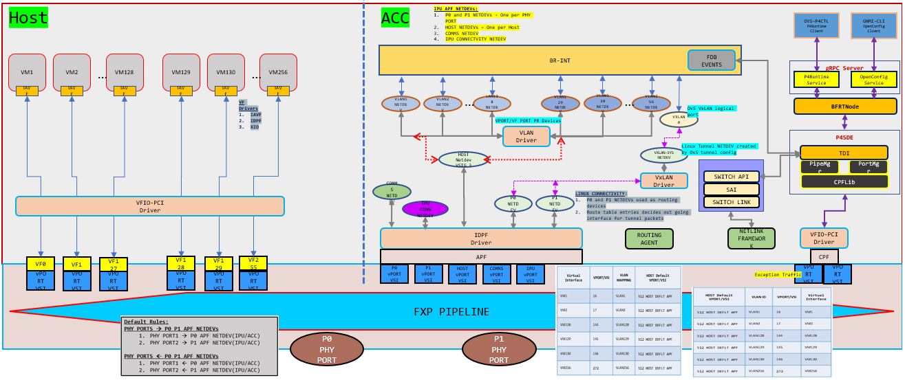

# Linux Networking for ES2K

Linux Networking provides support for offloading various networking functions, such as L2 forwarding, L3 forwarding, ECMP, and VxLAN encapsulation and decapsulation intelligence to the IPU. This capability empowers overlay services to establish communication with endpoints through VxLAN tunnels, thereby extending the L2 segment across the underlay network. To achieve Linux networking support, we have enhanced OvS for overlay source MAC learning and VxLAN configurations, while relying on the kernel for underlay neighbor discovery, route management, and next-hop information.

## Feature Overview

This feature can run in two modes:

- Slow path: All packets must land on the control plane and only the control plane has the intelligence to forward the traffic.
- Fast path: Only first unknown traffic (both SMAC and DMAC) will be sent to the control plane and subsequent traffic should be forwarded by IPU E2100.

To enable this feature we have,

- `Infrap4d`: This process includes a p4runtime server. Calls TDI front end to program IPU E2100.
- `ovs-vswitchd`: This process is integrated with p4runtime intelligence and acts as a gRPC client. Programs IPU E2100 with control plane configuration and forwarding tables by communicating with gRPC server.
- `p4rt-ctl`: This python CLI includes a p4runtime client. Programs IPU E2100 with runtime rules by communicating with gRPC server.
- `Kernel stack`: All underlay related configurations are picked by `kernel monitor` thread via netlink events in `infrap4d` and these are programmed in IPU E2100 by calling TDI front end APIs.

## Topology

This topology breakdown and configuration assumes all VMs are spawned on HOST VFs and the control plane is running on ACC.



### Topology breakdown

- Every VM spawned on top of a VF will have a corresponding port representor in ACC.
- Every physical port will have a corresponding port representor in ACC.
- Every physical port will have an uplink (APF netdev) in HOST and this uplink will have a corresponding port representor in ACC.
- All port representors are associated with an OvS bridge.
- For VxLAN egress traffic, the underlay port should be associated with a termination bridge. The IP address to reach the underlay network should be configured on this bridge.

## Detailed Design

### Slow path

To enable slow path mode:

- Start the infrap4d process with the Kernel Monitor disabled. Command: `infrap4d -disable-krnlmon`
- Set environment variable `OVS_P4_OFFLOAD=false` before starting the `ovs-vswitchd` process.

In this mode, VMs are spawned on top of VFs and associated with their port representors. Also, physical ports are associated with their port representors. Configure the following tables to map these in IPU:

```text
- rx_source_port
- tx_source_port_v4/tx_source_port_v6
- tx_acc_vsi
- vsi_to_vsi_loopback
- source_port_to_pr_map
- rx_phy_port_to_pr_map
```

All port representors (PRs) in ACC should be associated with an OvS bridge. Configure table below to program the mapping between PRs and bridges in IPU:

```text
- source_port_to_bridge_map
```

For egress VxLAN traffic, an OvS VxLAN port needs to be created in ACC with associated integration bridge that handles overlay traffic. Configure following tables to map these in IPU:

```text
- rx_ipv4_tunnel_source_port/rx_ipv6_tunnel_source_port
- source_port_to_bridge_map
```

Once these tables are configured refer to packet flow as mentioned below.

#### For slow path Tx forwarding

##### Slow path egress traffic without VxLAN encapsulation

Packets coming from overlay network:

- Determine the source port of the packet based on which overlay VSI the packet has landed on.
- Validate if the source port is part of the bridge, else drop the packet.
- If valid bridge configuration is found, find the PR associated with the bridge and forward the packet to the PR in ACC.
- OvS control plane receives the packet and forwards the packet to destined PR if MAC is already learnt, else floods the packet in the valid bridge found.
- Sample OvS config:

    ```bash
    ovs-vsctl add-br br-int
    ovs-vsctl add-port br-int <Overlay VMs PR>
    ovs-vsctl add-port br-int <Physical port PR>
    ```

##### Slow path egress traffic with VxLAN encapsulation

Packets coming from overlay network:

- Determine the source port of the packet based on which overlay VSI the packet has landed on.
- Validate if the source port is part of the bridge, else drop the packet.
- If valid bridge configuration is found, find the PR associated with the bridge and forward the packet to the PR in ACC.
- OvS control plane receives the packet and forwards the packet to the destined VxLAN port if MAC is already learnt, else flood the packet in the valid bridge found.
- Once the packet reaches the VxLAN port, here the kernel checks the routing table to reach `remote_ip` that is configured for the OvS VxLAN tunnel.
- Underlay network to reach `remote_ip` is configured on a TEP termination bridge. The kernel resolves the ARP for underlay network.
- Once ARP is resolved, the kernel encapsulates the packet. It then forwards the packet to the PR of the physical port if the MAC is already learnt, or floods it to the TEP termination bridge if not.
- Sample OvS config:

    ```bash
    ovs-vsctl add-br br-int
    ovs-vsctl add-port br-int <Overlay VMs PR>
    ovs-vsctl add-port br-int <VxLAN port with VxLAN config>
    ovs-vsctl add-br br-tep-termination
    # Configure bridge with IP address to reach remote TEP
    ovs-vsctl add-port br-tep-termination <Physical port PR>
    ```

#### For slow path Rx forwarding

##### Slow path ingress traffic without VxLAN encapsulation

If the packet coming from a remote machine to the physical port is not VxLAN encapsulated packet:

- Determine the source port of the packet based on which physical port the packet has landed on.
- Validate if the source port is part of the bridge, else drop the packet.
- If valid bridge configuration is found, find the PR associated with the bridge and forward the packet to the PR in ACC.
- OvS control plane receives the packet and forwards it to destined PR if MAC is already learnt, else floods the packet in the valid bridge found.
- Sample OvS config:

    ```bash
    ovs-vsctl add-br br-int
    ovs-vsctl add-port br-int <Overlay VMs PR>
    ovs-vsctl add-port br-int <Physical port PR>
    ```

##### Slow path ingress traffic with VxLAN encapsulation

If the packet coming from a remote machine to the physical port is VxLAN encapsulated packet:

- Determine the source port of the packet based on which physical port the packet has landed on.
- Validate if the source port is part of the bridge, else drop the packet.
- If valid bridge configuration is found, find the PR associated with the physical port and forward the packet to the PR in ACC.
- OvS control plane receives the packet on a TEP termination bridge, packet gets decapped and sent to VxLAN port.
- Since VxLAN port and overlay VMs PR are in the same bridge, if the overlay MAC is already learnt the packet will be forwarded to destined PR else packet will be flooded in the valid bridge found.
- Sample OvS config:

    ```bash
    ovs-vsctl add-br br-int
    ovs-vsctl add-port br-int <Overlay VMs PR>
    ovs-vsctl add-port br-int <VxLAN port with VxLAN config>
    ovs-vsctl add-br br-tep-termination             ## this bridge has IP to reach remote TEP
    ovs-vsctl add-port br-tep-termination <Physical port PR>
    ```

### Fast path (when IPU forwards the packet)

To enable fast path mode:

- Start the infrap4d process. Command: `infrap4d`
- Remove the environment variable `OVS_P4_OFFLOAD=false` before starting the `ovs-vswitchd` process.

In this mode, we need to associate VFs with the VMs and its port representors along with physical ports and its port representors.
Configure tables:

```text
- rx_source_port
- tx_source_port_v4/tx_source_port_v6
- tx_acc_vsi
- vsi_to_vsi_loopback
- source_port_to_pr_map
- rx_phy_port_to_pr_map
- tx_lag_table     ## This is a dummy LAG entry when we have underlay as Non LAG case.
```

Once OvS bridge is created and PR's are added to the OvS bridge, a unique bridge ID for the OvS bridge is created and creates a mapping between ACC PR's & OvS bridge. This mapping is programed in IPU E2100 with,

```text
- source_port_to_bridge_map
- vlan_push_mod_table                           ## If ACC PR is part of a VLAN
- vlan_pop_mod_table                            ## If ACC PR is part of a VLAN
```

Once a VxLAN tunnel is created on a particular OvS bridge, we program IPU E2100 with,

```text
- rx_ipv4_tunnel_source_port/rx_ipv6_tunnel_source_port
- vxlan_encap_mod_table/vxlan_encap_v6_mod_table
- vxlan_encap_vlan_pop_mod_table/vxlan_encap_v6_vlan_pop_mod_table        ## If VxLAN is part of a VLAN
- vxlan_decap_mod_table
- vxlan_decap_and_push_vlan_mod_table                                     ## If VxLAN is part of a VLAN
- ipv4_tunnel_term_table/ipv6_tunnel_term_table
```

When the first packet (either Tx or Rx) reaches the IPU, since no rules are programmed, this packet will be sent to respective PR's. From PR's OvS learns the MAC address and control plane dynamically programs,

```text
- l2_fwd_smac_table
- l2_fwd_tx_table
- l2_fwd_rx_table
- l2_to_tunnel_v4/l2_to_tunnel_v6
```

When underlay network is configured and underlay neighbor is learnt we dynamically program,

```text
- ipv4_table/ipv6_table
- nexthop_table
- neighbor_mod_table
```

Once these tables are configured refer to packet flow as mentioned below.

#### For fast path Tx forwarding

##### Fast path egress traffic without VxLAN encapsulation

Packets coming from overlay network:

- Determine the source port of the packet based on which overlay VSI the packet has landed on.
- Validate if the source port is part of the bridge, else drop the packet.
- If valid bridge configuration is found, check if SMAC of the packet is learnt.
- Check if DMAC packet is learnt against the bridge derived above. If entry matches, forward the packet to VF corresponding to the physical port.
- Sample OvS config:

    ```bash
    ovs-vsctl add-br br-int
    ovs-vsctl add-port br-int <Overlay VMs PR>
    ovs-vsctl add-port br-int <Physical port PR>
    ```

##### Fast path egress traffic with VxLAN encapsulation

Packets coming from overlay network:

- Determine the source port of the packet based on which overlay VSI the packet has landed on.
- Check if the DMAC of the packet is reachable via the VxLAN tunnel and set the remote_ip of the tunnel.
- Validate if the source port is part of the bridge, else drop the packet.
- If valid bridge configuration is found, check if SMAC of the packet is learnt.
- Check if DMAC packet is learnt against the bridge derived above. If yes, populated Src IP, Dest IP, VNI, SRC port and Dest port of outer packet.
- Based on the above derived remote_ip, retrieve what is the nexthop from ipv4_table.
- Derive from which physical port this nexthop is learnt and add the nexthop MAC address as DMAC and underlay port MAC as SMAC of the packet.
- Sample OvS config:

    ```bash
    ovs-vsctl add-br br-int
    ovs-vsctl add-port br-int <Overlay VMs PR>
    ovs-vsctl add-port br-int <VxLAN port with VxLAN config>
    ovs-vsctl add-br br-tep-termination             ## this bridge has IP to reach remote TEP
    ovs-vsctl add-port br-tep-termination <Physical port PR>
    ```

#### For fast path Rx forwarding

##### Fast path ingress traffic without VxLAN encapsulation

If the packet coming from a remote machine to the physical port is not VxLAN encapsulated packet:

- Determine the source port of the packet based on which physical port the packet has landed on.
- Validate if the source port is part of the bridge, else drop the packet.
- If valid bridge configuration is found, check if the inner SMAC of the packet is learnt.
- Check if the inner DMAC packet is learnt against the bridge derived above. If entry matches, forward the packet to VF corresponding to the overlay VM.
- Sample OvS config:

    ```bash
    ovs-vsctl add-br br-int
    ovs-vsctl add-port br-int <Overlay VMs PR>
    ovs-vsctl add-port br-int <Physical port PR>
    ```

##### Fast path ingress traffic with VxLAN encapsulation

If the packet coming from a remote machine to the physical port are VxLAN encapsulated packet:

- Determine the source port of the packet based on which physical port the packet has landed
- Validate if the source port is part of the bridge, else drop the packet.
- If valid bridge configuration is found, check if the inner SMAC of the packet is learnt.
- Check if the inner DMAC packet is learnt against the bridge derived above. If entry matches, decap the outer packet and forward the inner packet to the overlay VF where DMAC is learnt.
- Sample OvS config:

    ```bash
    ovs-vsctl add-br br-int
    ovs-vsctl add-port br-int <Overlay VMs PR>
    ovs-vsctl add-port br-int <VxLAN port with VxLAN config>
    ovs-vsctl add-br br-tep-termination             ## this bridge has IP to reach remote TEP
    ovs-vsctl add-port br-tep-termination <Physical port PR>
    ```

## Summary

- Verification of source port and associated L2 Bridge: The P4 Control Plane (P4 CP) must ensure the validation of the source port and its corresponding L2 bridge before initiating any further regulation of datapath packet classification.
- Exception packet handling for all protocols: The P4 Control Plane (P4 CP) shall incorporate exception packet handling logic, not limited to ARP but applicable to the first packet of any protocol.
- Offloading of networking functions: The P4 Control Plane (P4 CP) software shall provide support for the offloading of various networking functions as specified in the Linux Networking use case. These networking functions include Layer 2 (L2) and Layer 3 (L3) forwarding, Equal-Cost Multi-Path (ECMP) routing, Link Aggregation Group (LAG), as well as Virtual Extensible LAN (VXLAN) encapsulation and decapsulation. These functions shall support both single and multiple Open vSwitch (OvS) bridges.

## Limitations

Current Linux Networking support for the networking recipe has the following limitations:

- VLAN configuration on OvS is supported only for NATIVE-TAG and NATIVE-UNTAG modes.
- Physical port's port representor should be added as the first port in tunnel TEP bridge (br-tep-termination).
- Only OvS bridges are supported.
- Configure p4rt-ctl runtime rules before OvS configuration.
- Double vlan tag is NOT supported.
- Add all ACC PR's to VSI group 1.
- On ACC, firewall needs to be disabled. Otherwise, this service will block encapsulated packets.
  - systemctl stop firewalld
- LAG and ECMP are mutually exclusive. Both can't co-exist in the system configuration at the same time.
- LAG configuration done via bonding driver is supported.
- The supported modes are active-backup and active-active with 802.3ad (LACP).
