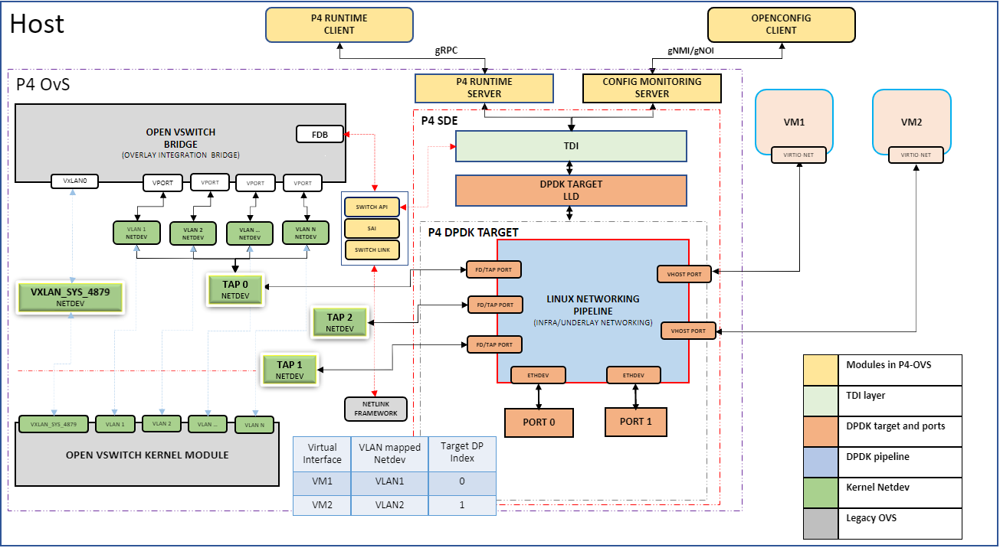

# Linux Networking

<!--
Copyright 2022-2023 Intel Corporation
SPDX-License-Identifier: Apache-2.0
-->

This page describes a step-by-step procedure to run Linux networking scenario.

## Topology



Notes about topology:

- VHOST ports, TAP ports, Physical LINK ports are created by gNMI CLI, and
  LINK port is bound to the DPDK target.
- VLAN 1, VLAN 2, .... VLAN N are created using Linux commands, and are on
  top of a TAP port. The number of VLAN ports should be equal to the number
  of VM's that are spawned.
- br-int, VxLAN0 ports are created using the ovs-vsctl command provided by OvS.
  All VLAN ports are attached to br-int using ovs-vsctl command.

System under test will have above topology running the networking recipe.
Link Partner can have either the networking recipe or legacy OVS or kernel
VxLAN. Note the [Limitations](#limitations) below before setting up the topology.

## Create P4 artifacts

1. Install the [p4c compiler](https://github.com/p4lang/p4c)
   from the p4lang/p4c repository and follow the instructions in the
   [readme file](https://github.com/p4lang/p4c/blob/main/README.md).

2. Set the environment variable OUTPUT_DIR to the location where artifacts
   should be generated and p4 files are available. For example:

   ```bash
   export OUTPUT_DIR=$IPDK_RECIPE/p4src/linux_networking
   ```

3. Compile the P4 program using p4c-dpdk:

   ```bash
   p4c-dpdk --arch pna --target dpdk \
       --p4runtime-files $OUTPUT_DIR/p4Info.txt \
       --bf-rt-schema $OUTPUT_DIR/bf-rt.json \
       --context $OUTPUT_DIR/context.json \
       -o $OUTPUT_DIR/linux_networking.spec \
       $OUTPUT_DIR/linux_networking.p4
   ```

4. Modify the sample configuration file
   ($IPDK_RECIPE/p4src/linux_networking/dpdk/lnw.conf)
   to specify the absolute paths of the artifacts (json and spec files).

5. Generate binary image using tdi-pipeline builder:

   ```bash
   tdi_pipeline_builder --p4c_conf_file=lnw.conf \
       --bf_pipeline_config_binary_file=lnw.pb.bin
   ```

## Limitations

Current SAI enablement for the networking recipe has following limitations:

- All VHOST user ports need to be configured first and only then TAP ports/physical ports
- TAP port created for the corresponding link port should be created using "gnmi-ctl control port creation got the link port"
  e.g., gnmi-ctl set "device:physical-device,name:PORT0,pipeline-name:pipe,mempool-name:MEMPOOL0,control-port:TAP1,mtu:1500,pci-bdf:0000:18:00.0,packet-dir=network,port-type:link"
- All VLAN interfaces created on top of TAP ports should always be in lowercase
  format "vlan+vlan_id" (e.g, vlan1, vlan2, vlan3, ... vlan4094).
- br-int port, vxlan0 port and adding vlan ports to br-int need to be done after loading the pipeline.
- VxLAN destination port should always be standard port (4789). (limitation by p4 parser)
- Only VNI 0 is supported.
- We are not supporting any ofproto rules which would not allow for FDB learning on OVS.

## Steps to create the topology

The [gnmi-ctl](/clients/gnmi-ctl) and [p4rt-ctl](/clients/gnmi-ctl) utilities
used below can be found in $IPDK_RECIPE/install/bin. They should be run with
`sudo`.

## 1) Bind physical port to IO driver

1. Load uio and vfio-pci drivers.

   ```bash
   modprobe uio
   modprobe vfio-pci
   ```

2. Bind the devices to DPDK using dpdk-devbind.py script.

   ```bash
   cd $SDE_INSTALL/bin
   ./dpdk-devbind.py --bind=vfio-pci PCI-BDF
   ```

   For example:

   ```bash
   ./dpdk-devbind.py --bind=vfio-pci 0000:18:00.0
   ```

   PCI-BDF can be obtained using the `lspci` command. Check if device is bound
   correctly using `./dpdk-devbind.py -s`. (See the section "Network devices
   using DPDK-compatible driver")

## 2) Start infrap4d

```bash
alias sudo="sudo PATH=$PATH HOME=$HOME LD_LIBRARY_PATH=$LD_LIBRARY_PATH SDE_INSTALL=$SDE_INSTALL"

sudo $IPDK_RECIPE/install/bin/infrap4d
```

## 3) Create ports

1. Create two VHOST user ports.

   ```bash
   gnmi-ctl set "device:virtual-device,name:net_vhost0,host-name:host1,device-type:VIRTIO_NET,queues:1,socket-path:/tmp/vhost-user-0,packet-dir:host,port-type:LINK"

   gnmi-ctl set "device:virtual-device,name:net_vhost1,host-name:host2,device-type:VIRTIO_NET,queues:1,socket-path:/tmp/vhost-user-1,packet-dir:host,port-type:LINK"
    ```

2. Create two physical link ports with control port.

   ```bash
   gnmi-ctl set "device:physical-device,name:PORT0,control-port:TAP1,pci-bdf:0000:18:00.0,packet-dir:network,port-type:link"

   gnmi-ctl set "device:physical-device,name:PORT1,control-port:TAP2,pci-bdf:0000:18:00.1,packet-dir:network,port-type:link"
   ```

   Specify the PCI-BDF of the devices bound to user-space in step 1.
   Corresponding control port for physical link port will be created if control
   port attribute is specified.

3. Create two TAP ports.

   ```bash
   gnmi-ctl set "device:virtual-device,name:TAP0,pipeline-name:pipe,mempool-name:MEMPOOL0,mtu:1500,packet-dir:host,port-type:TAP"

   gnmi-ctl set "device:virtual-device,name:TAP3,pipeline-name:pipe,mempool-name:MEMPOOL0,mtu:1500,packet-dir:host,port-type:TAP"
   ```

Notes:

- Pkt-dir parameter is to specify the direction of traffic. It can take two
  values - host/network. Value 'host' specifies that traffic on this port will
  be internal (within the host). Value 'network' specifies that a particular
  port can receive traffic from network.
- The number of ports created should be a power of 2 to satisfy DPDK
  requirements. When counting the number of ports, include control ports
  created along with physical link port (e.g., TAP1 and TAP2).

## 4) Spawn VMs and assign IPs

Spawn two VMs on the vhost-user ports created in step 3. Start the VM's and
assign IP addresses.

```bash
ip addr add 99.0.0.1/24 dev eth0
ip link set dev eth0 up
ip addr add 99.0.0.2/24 dev eth0
ip link set dev eth0 up
```

## 5) Bring up interfaces

Option 1: Use one of the TAP ports as tunnel termination and assign IP address
to the TAP port.

```bash
ip link set dev TAP0 up
ip addr add 40.1.1.1/24 dev TAP1
ip link set dev TAP1 up
ip link set dev TAP2 up
ip link set dev TAP3 up
```

Option 2: Create a dummy port and use it for tunnel termination. Route to
reach dummy port will be statically configured on peer or this route will be
re-distributed to the peer via routing protocols available from FRR.

```bash
ip link add dev TEP1 type dummy

ip link set dev TAP0 up
ip link set dev TAP1 up
ip link set dev TAP2 up
ip link set dev TAP3 up
ip link set dev TEP1 up
```

## 6) Set pipeline

```bash
p4rt-ctl set-pipe br0 lnw.pb.bin p4Info.txt
```

## 7) Start ovs-vswitchd and ovsdb-server

Kill any existing ovs process if running.

```bash
mkdir -p $IPDK_RECIPE/install/var/run/openvswitch
rm -rf $IPDK_RECIPE/install/etc/openvswitch/conf.db

sudo $IPDK_RECIPE/install/bin/ovsdb-tool create \
    $IPDK_RECIPE/install/etc/openvswitch/conf.db \
    $IPDK_RECIPE/install/share/openvswitch/vswitch.ovsschema

export RUN_OVS=$IPDK_RECIPE/install

sudo $IPDK_RECIPE/install/sbin/ovsdb-server \
    --remote=punix:$RUN_OVS/var/run/openvswitch/db.sock \
    --remote=db:Open_vSwitch,Open_vSwitch,manager_options \
    --pidfile --detach

sudo $IPDK_RECIPE/install/sbin/ovs-vswitchd --detach --no-chdir \
    unix:$RUN_OVS/var/run/openvswitch/db.sock --mlockall \
    --log-file=/tmp/ovs-vswitchd.log

sudo $IPDK_RECIPE/install/bin/ovs-vsctl \
    --db unix:$RUN_OVS/var/run/openvswitch/db.sock show

sudo $IPDK_RECIPE/install/bin/ovs-vsctl add-br br-int
ifconfig br-int up
```

## 8) Configure VXLAN port

Option 1: When one of the TAP ports is used for tunnel termination.

```bash
sudo $IPDK_RECIPE/install/bin/ovs-vsctl add-port br-int vxlan1 -- \
    set interface vxlan1 type=vxlan options:local_ip=40.1.1.1 \
    options:remote_ip=40.1.1.2 options:dst_port=4789
```

Option 2: When a dummy port is used for tunnel termination. Here, remote IP
is on a different network. Route to reach peer needs to be [statically
configured](#configure-static-route) or
[learned via FRR](#learn-dynamic-routes-via-ffr).

```bash
sudo $IPDK_RECIPE/install/bin/ovs-vsctl add-port br-int vxlan1 -- \
    set interface vxlan1 type=vxlan options:local_ip=40.1.1.1 \
    options:remote_ip=30.1.1.1 options:dst_port=4789
```

VXLAN destination port should always be the standard port (4789).
(limitation of p4 parser)

### 9) Configure VLAN ports on TAP0 and add them to br-int

```bash
ip link add link TAP0 name vlan1 type vlan id 1
ip link add link TAP0 name vlan2 type vlan id 2
sudo $IPDK_RECIPE/install/bin/ovs-vsctl add-port br-int vlan1
sudo $IPDK_RECIPE/install/bin/ovs-vsctl add-port br-int vlan2
ip link set dev vlan1 up
ip link set dev vlan2 up
```

All VLAN interfaces should be created on top of TAP ports, and should always
be in lowercase format "vlan+vlan_id" (e.g., vlan1, vlan2, vlan3, ...
vlan4094).

## 10) Configure rules

### Rules to push/pop VLAN

Configure rules to push and pop VLAN from vhost 0 and 1 ports to TAP0 port
(vhost-user and vlan port mapping).

Port number used in p4rt-ctl commands are target datapath indexes (unique
identifier for each port), which can be queried using commands below. With the
current SDE, tdi-portin-id and tdi-portout-id are the same.

```bash
gnmi-ctl get "device:virtual-device,name:net_vhost0,tdi-portin-id"
gnmi-ctl get "device:virtual-device,name:net_vhost0,tdi-portout-id"
```

Target DP index of control TAP port will be Target DP index of corresponding
physical port + 1. If the ports are created in the order mentioned above,
target datapath indexes will be:

| Port name          | Target DP index |
|--------------------|-----------------|
| vhost-user-0 (VM1) | 0 |
| vhost-user-1 (VM2) | 1 |
| phy-port0          | 2 |
| TAP1               | 3 |
| phy-port1          | 4 |
| TAP2               | 5 |
| TAP0               | 6 |
| TAP3               | 7 |

Rules to configure:

1. For any tx control packet from VM1 (TDP 0), pipeline should add
   VLAN tag 1 and send it to TAP0 port (TDP 6).

   ```bash
   p4rt-ctl add-entry br0 linux_networking_control.handle_tx_control_pkts_table \
       "istd.input_port=0,action=linux_networking_control.push_vlan_fwd(6,1)"
   ```

2. For any tx control packet from VM2 (TDP 1), pipeline should add a VLAN
   tag 2 and send it to TAP0 port (TDP 6).

   ```bash
   p4rt-ctl add-entry br0 linux_networking_control.handle_tx_control_pkts_table \
       "istd.input_port=1,action=linux_networking_control.push_vlan_fwd(6,2)"
   ```

3. For any tx control packet from TAP0 port (TDP 6) with VLAN tag 1, pipeline
   should pop the VLAN tag and send it to VM1 (TDP 0).

   ```bash
   p4rt-ctl add-entry br0 linux_networking_control.handle_tx_control_vlan_pkts_table \
       "istd.input_port=6,local_metadata.vlan_id=1,action=linux_networking_control.pop_vlan_fwd(0)"
   ```

4. For any tx control packet from TAP0 port (TDP 6) with VLAN tag 2,
   pipeline should pop the VLAN tag and send it to VM2 (TDP 1).

   ```bash
   p4rt-ctl add-entry br0 linux_networking_control.handle_tx_control_vlan_pkts_table \
       "istd.input_port=6,local_metadata.vlan_id=2,action=linux_networking_control.pop_vlan_fwd(1)"
   ```

### Rules for control packets coming in and out of physical port

1. Any rx control packet from phy port0 (TDP 2) should be sent to
   corresponding control port TAP1 (TDP 3).

   ```bash
   p4rt-ctl add-entry br0 linux_networking_control.handle_rx_control_pkts_table \
       "istd.input_port=2,action=linux_networking_control.set_control_dest(3)"
   ```

2. Any rx control packet from phy port1 (TDP 4) should be sent to
   corresponding control port TAP2 (TDP 5).

   ```bash
   p4rt-ctl add-entry br0 linux_networking_control.handle_rx_control_pkts_table\
        "istd.input_port=4,action=linux_networking_control.set_control_dest(5)"
   ```

3. Any tx control packet from control TAP1 port (TDP 3) should be sent to
   corresponding physical port phy port0 (TDP 2).

   ```bash
   p4rt-ctl add-entry br0 linux_networking_control.handle_tx_control_pkts_table \
       "istd.input_port=3,action=linux_networking_control.set_control_dest(2)"
   ```

4. Any tx control packet from control TAP2 port (TDP 5) should be sent to
   corresponding physical port phy port1 (TDP 4).

   ```bash
   p4rt-ctl add-entry br0 linux_networking_control.handle_tx_control_pkts_table \
       "istd.input_port=5,action=linux_networking_control.set_control_dest(4)"
   ```

## 11) Configure routes

Only needed when dummy port is used for tunnel termination.

<!-- markdownlint-disable MD033 -->
### Option 1: Configure static route <a name="configure-static-route"/>
<!-- markdownlint-enable MD033 -->

```bash
ip addr add 40.1.1.1/24 dev TEP1
ip addr add 50.1.1.1/24 dev TAP1
ip route add 30.1.1.1 nexthop via 50.1.1.2 dev TAP1
```

<!-- markdownlint-disable MD033 -->
### Option 2: Learn dynamic routes via FRR <a name="learn-dynamic-routes-via-ffr"/>
<!-- markdownlint-enable MD033 -->

Install FRR:

- Install FRR via default package manager, like `apt install frr` for
  Ubuntu or `dnf install frr` for Fedora.
- If not, see the [official FRR documentation](https://docs.frrouting.org/en/latest/installation.html)
  and install according to your distribution.

Configure FRR:

- Modify /etc/frr/daemons to enable bgpd daemon
- Restart FRR service. systemctl restart frr
- Start VTYSH process, which is a CLI provided by FRR for user configurations.
- Set the configuration on the DUT (host1) for single-path scenario.

  ```bash
  interface TAP1
  ip address 50.1.1.1/24
  exit
  !
  interface TEP1
  ip address 40.1.1.1/24
  exit
  !
  router bgp 65000
  bgp router-id 40.1.1.1
  neighbor 50.1.1.2 remote-as 65000
  !
  address-family ipv4 unicast
    network 40.1.1.0/24
  exit-address-family
  ```

Once Peer is also configured, we should see neighbor 50.1.1.2 is learnt on
DUT (host1) and also route learnt on the kernel.

```bash
30.1.1.0/24 nhid 54 via 50.1.1.2 dev TAP1 proto bgp metric 20
```

## 12) Test ping scenarios

- Ping between VM's on the same host
- Underlay ping
- Overlay ping: Ping between VM's on different hosts
