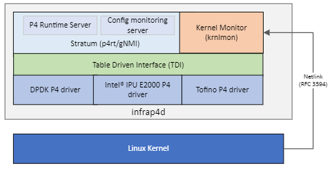

# Overview

P4 Control Plane (formerly P4-OVS Split Architecture) modularizes P4-OVS
and reduces coupling between its components, making the code easier to maintain
and more suitable for upstreaming. It moves the P4-specific components of the
architecture to a separate process called `infrap4d`.

## Infrap4d

Infrap4d integrates Stratum, Kernel Monitor (krnlmon), Switch Abstraction
Interface (SAI), Table Driven Interface (TDI), and a P4 target driver into a
single process (daemon).

### Kernel monitor (krnlmon)

The Kernel Monitor receives RFC 3549 messages from the Linux Kernel over a
Netlink socket when changes are made to the kernel networking data structures.
It listens for network events (link, address, neighbor, route) and issues
calls to update the P4 tables via SAI and TDI. The kernel monitor is an
optional component of infrap4d.

### Open vSwitch (OvS)

Open vSwitch is an open-source multi-layer software virtual switch that is
well-suited to bridging traffic across virtual machines and providing
connections to the outside world. P4 Control Plane incorporates an optional
component (`ovs-p4rt`) that allows OVS to communicate with the P4Runtime
Server in Infrap4d via gRPC.

### Stratum

Stratum is an open-source silicon-independent switch operating system.
It is a component of Infrap4d that provides the P4Runtime and gNMI/Openconfig
capabilities for P4 flow rule offloads and port configuration offloads.
Stratum is augmented with a new tdi platform layer that processes P4rt and
gNMI requests and interacts with the underlying P4 target driver through TDI.
A new ipdk platform layer provides IPDK-specific replacements for several
TDI modules that allow it to handle configuration differences between IPUs
and the switches for which Stratum was developed.

### Switch Abstraction Interface (SAI)

Switch Abstraction Interface (SAI) defines a vendor-independent interface
for switching ASICs.

### Table Driven Interface (TDI)

TDI (Table Driven Interface) provides a target-agnostic interface to the
driver for a P4-programmable device. It is a set of APIs that enable
configuration and management of P4 programmable and fixed functions of a
backend device in a uniform and dynamic way. Different targets like bmv2
and P4-DPDK can choose to implement their own backends for different P4
and non-P4 objects but can share a common TDI. Stratum talks to the
target-specific driver through the TDI front-end interface.

## gNMI clients

gRPC Network Management Interface (gNMI) is a gRPC-based protocol to manage
network devices.

### gnmi_cli

Command-line client that can be used for testing and sending
messages to a gNMI server (such as `infrap4d`). Part of Stratum.

### gnmi-ctl

Derivative of `gnmi_cli` that was introduced in P4-OVS and continues to
be part of the DPDK target build. `gnmi-ctl` is being phased out in favor of
`gnmi_cli` and `sgnmi_cli`.

### sgnmi_cli

Version of `gnmi_cli` that is secure by default. It uses TLS certificates
to communicate securely with the server.

## P4Runtime clients

P4Runtime interface is a control plane specification for managing the
data plane elements of a device defined or described by a P4 program.

### ovs-p4rt

Library (C++ with a C interface) that allows ovs-vswitchd and ovsdb-server
to communicate with the P4Runtime Server in Infrap4d via gRPC. It is used to
program (insert/modify/delete) P4 forwarding tables in the pipeline.

### p4rt-ctl

Command-line client that talks to the P4Runtime Server in
Infrap4d via gRPC. It is used to program the P4 pipeline and insert/delete
P4 table entries.
