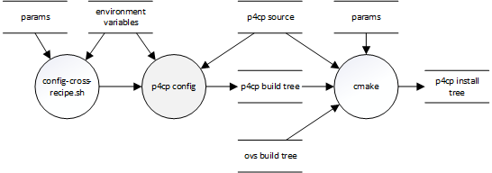

.. Copyright 2023 Intel Corporation
   SPDX-License-Identifier: Apache 2.0

======================
config-cross-recipe.sh
======================

Helper script to configure CMake to cross-compile P4 Control Plane
for the Arm Compute Complex (ACC).

Build flow
==========

The ``config-cross-recipe.sh`` script is run after ``make-cross-ovs.sh``,
to configure the remainder of the P4 Control Plane build.

After running this script, you will need to issue a separate command
to build and install the software. For example:

.. code-block:: bash

   cmake --build build -j8 --target install

Syntax
======

.. code-block:: text

  ./scripts/es2k/config-cross-recipe.sh \
      [--help|-h]  \
      [--dry-run|-n] \
      [--build=BLDDIR | -B BLDDIR] \
      [--deps=DEPS | -D DEPS] \
      [--host=HOSTDEPS | -H HOSTDEPS] \
      [--ovs=OVS | -O OVS] \
      [--prefix=PREFIX | -P PREFIX] \
      [--sde=SDE | -S SDE] \
      [--toolchain=TOOLFILE | -T TOOLFILE ] \
      [--no-krnlmon] \
      [--no-ovs]

Command-line parameters
=======================

General
-------

``--dry-run``, ``-n``
  Displays the parameters that will be passed to CMake, and exits.

``--help``, ``-h``
  Displays usage information and exits.

Host paths
----------

``--build=BLDDIR``, ``-B BLDDIR``
  Directory that CMake will use to perform the build.
  Will be created if it does not exist.

  Specifies the value of the ``-B`` CMake option.
  Can be used to create separate build directories for native and
  cross-compiled builds.
  Defaults to ``build``.

``--host=HOST``, ``-H HOST``
  Directory in which the Stratum dependencies for the development
  system are installed.

  Used to compile Protobufs to C++ during cross-compilation.
  Supplies the value of the ``HOST_DEPEND_DIR`` listfile variable.
  Defaults to the value of the ``HOST_INSTALL`` environment variable,
  if defined.
  Otherwise, defaults to ``setup/hostdeps``.

``--toolchain=FILE``, ``-T FILE``
  Path to the CMake toolchain file.

  Specifies the value of the ``CMAKE_TOOLCHAIN_FILE`` variable.
  Defaults to the value of the ``CMAKE_TOOLCHAIN_FILE`` environment
  variable.

Target paths
------------

``--deps=DEPS``, ``-D DEPS`` *(see note)*
  Directory in which the Stratum dependencies for the runtime system
  are installed.

  P4 Control Plane will be linked with these libraries.
  Supplies the value of the ``DEPEND_INSTALL_DIR`` listfile variable.
  Defaults to the value of the ``DEPEND_INSTALL`` environment variable,
  if defined.
  Otherwise, defaults to ``//opt/deps``.

``--ovs=OVS``, ``-O OVS`` *(see note)*
  Directory in which Open vSwitch is installed.

  May be omitted if the ``--no-ovs`` option is specified.
  Supplies the value of the ``OVS_INSTALL_DIR`` listfile variable for
  the P4 Control Plane build.
  May be the same as the ``prefix`` directory, in which case OVS and
  P4 Control Plane will be installed to the same directory tree.
  Defaults to the value of the ``OVS_INSTALL`` environment variable,
  if defined.
  Otherwise, defaults to ``//opt/ovs``.

``--prefix=PREFIX``, ``-P PREFIX`` *(see note)*
  Directory in which P4 Control Plane will be installed.
  Will be created if it does not exist.

  May be the same as the ``--ovs`` option, in which case OVS and
  P4 Control Plane will be installed to the same directory tree.
  Specifies the value of the ``CMAKE_INSTALL_PREFIX`` variable when
  building P4 Control Plane.

``--sde=SDE``, ``-S SDE`` *(see note)*
  Directory in which the SDK for the Intel® IPU E2100 is installed.

  Supplies the value of the ``SDE_INSTALL_DIR`` listfile variable.
  Defaults to the value of the ``SDE_INSTALL`` environment variable,
  if defined.
  Otherwise, defaults to ``//opt/p4sde``.

.. note::
  ``//`` at the beginning of the directory path will be replaced with
  the *sysroot* directory path.

Options
-------

``--no-krnlmon``
  Excludes the Kernel Monitor from the build.

  Sets the ``WITH_KRNLMON`` listfile option to FALSE.

``--no-ovs``
  Excludes OVS from the build.

  Sets the ``WITH_OVSP4RT`` listfile option to FALSE.

Environment variables
=====================

``CMAKE_TOOLCHAIN_FILE``
  Path to the CMake toolchain file to be used.
  Specifies the value of the ``CMAKE_TOOLCHAIN_FILE`` variable.
  May be overridden by ``--toolchain=TOOLFILE``.
  Must be defined.

``DEPEND_INSTALL``
  Directory in which the Stratum dependencies for the runtime system
  are installed.
  Supplies the default value of the ``--deps`` option.

``HOST_INSTALL``
  Directory in which the Stratum dependencies for the development system
  are installed.
  Supplies the default value of the ``--host`` option.

``OVS_INSTALL``
  Directory in which Open vSwitch is installed.
  Supplies the default value of the ``--ovs`` option.

``SDE_INSTALL``
  Directory in which the SDK for the IPU E2100 is installed.
  Supplies the default value of the ``--sde`` option.

``SDKTARGETSYSROOT``
  Path to the system root (sysroot) directory for the ARM Compute Complex
  (ACC) of the IPU E2100.
  Must be defined.
