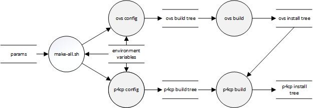

.. Copyright 2023 Intel Corporation
   SPDX-License-Identifier: Apache 2.0

===========
make-all.sh
===========

Helper script to build and install the P4 Control Plane software.

Build flow
==========

The ``make-all.sh`` script builds and installs Open vSwitch (OVS), and then
builds and installs the rest of P4 Control Plane.

Syntax
======

.. code-block:: text

  ./make-all.sh \
      [--help|-h]  [--dry-run|-n] \
      [--deps=DEPS | -D DEPS] \
      [--host=HOSTDEPS | -H HOSTDEPS] \
      [--ovs=OVS | -O OVS] \
      [--prefix=PREFIX | -P PREFIX] \
      [--sde=SDE | -S SDE] \
      [--toolchain=TOOLFILE | -T TOOLFILE ] \
      [--coverage] [--cxx=STD] \
      [--jobs=NJOBS | -j NJOBS] \
      [--no-build] \
      [--no-krnlmon] [--no-ovs] \
      [--target=dpdk|es2k|tofino] \
      [--debug|--minsize|--reldeb|--release]

Command-line parameters
=======================

General
-------

``--dry-run``, ``-n``
  Displays the parameters that will be passed to CMake, and exits.

``--help``, ``-h``
  Displays usage information and exits.

Paths
-----

``--deps=DEPS``, ``-D DEPS``
  Directory in which the Stratum dependencies for the runtime system
  are installed.

  P4 Control Plane will be linked with these libraries.
  Use this option instead of ``--host`` if are building for the native
  system (not cross-compiling).
  Supplies the value of the ``DEPEND_INSTALL_DIR`` listfile variable.
  Defaults to the value of the ``DEPEND_INSTALL`` environment variable.

``--host=HOST``, ``-H HOST``
  Directory in which the Stratum dependencies for the development system
  are installed.

  **Only used when cross-compiling**.
  Used to compile Protobufs to C++ during cross-compilation.
  Supplies the value of the ``HOST_DEPEND_DIR`` listfile variable.
  Defaults to the value of the ``HOST_INSTALL`` environment variable.

``--ovs=OVS``, ``-O OVS``
  Directory in which Open vSwitch will be (or is) installed.

  May be omitted if the ``--no-ovs`` option is specified.
  Specifies the value of ``CMAKE_INSTALL_PREFIX`` for the OVS build.
  Supplies the value of the ``OVS_INSTALL_DIR`` listfile variable for
  the networking recipe (P4 Control Plane) build.
  May be the same as the ``prefix`` directory, in which case OVS and
  P4 Control Plane will be installed to the same directory tree.
  Defaults to the value of the ``OVS_INSTALL`` environment variable.

``--prefix=PREFIX``, ``-P PREFIX``
  Directory in which P4 Control Plane will be installed.
  The directory will be created if it does not exist.

  May be the same as the ``--ovs`` option, in which case OVS and
  P4 Control Plane will be installed to the same directory tree.
  Specifies the value of the ``CMAKE_INSTALL_PREFIX`` variable when
  building P4 Control Plane.

``--sde=SDE``, ``-S SDE``
  Directory in which the SDK for the P4 target is installed.

  Supplies the value of the ``SDE_INSTALL_DIR`` listfile variable.
  Defaults to the value of the ``SDE_INSTALL`` environment variable.

``--toolchain=FILE``, ``-T FILE``
  Path to the CMake toolchain file.

  Must be specified when cross-compiling.
  Specifies the value of the ``CMAKE_TOOLCHAIN_FILE`` variable.
  Defaults to the value of the ``CMAKE_TOOLCHAIN_FILE`` environment variable.

Options
-------

``--coverage``
  Instrument build to measure unit test code coverage.
  Sets the ``TEST_COVERAGE`` listfile option to FALSE.

``--cxx=STD``
  C++ standard to be used by the compiler (11, 14, 17).
  Specifies the value of the ``CXX_STANDARD`` listfile variable.

``--jobs=NJOBS``, ``-j NJOBS``
  Number of build threads.
  Specifies the value of the ``-j`` CMake option.
  Defaults to 8 threads.

``--no-build``
  Configures CMake but does not build the dependencies.

``--no-krnlmon``
  Excludes the Kernel Monitor from the build.
  Sets the ``WITH_KRNLMON`` listfile option to FALSE.

``--no-ovs``
  Excludes OVS from the build.
  Sets the ``WITH_OVSP4RT`` listfile option to FALSE.

``--target=TARGET``
  Specifies the target (``dpdk``, ``es2k``, or ``tofino``) for which
  P4 Control Plane will be built.
  The target name is case-insensitive.
  Sets the ``TDI_TARGET`` listfile variable.
  Defaults to ``DPDK`` if unspecified.

Configurations
--------------

``--debug``
  Build with ``-DCMAKE_BUILD_TYPE=Debug``.
  The compiler settings will default to ``-g``.

``--minsize``
  Build with ``-DCMAKE_BUILD_TYPE=MinSizeRel``.
  The compiler settings will default to ``-Os -DNDEBUG``.

``--reldeb``
  Build with ``-DCMAKE_BUILD_TYPE=RelWithDebInfo``.
  The compiler settings will default to ``-O2 -g -DNDEBUG``.

``--release``
  Build with ``-DCMAKE_BUILD_TYPE=Release``.
  The compiler settings will default to ``-O3 -DNDEBUG``.

If no configuration is specified, the CMake listfile currently defaults to
``RelWithDebInfo``.

Environment variables
=====================

``CMAKE_TOOLCHAIN_FILE``
  Path to the CMake toolchain file to be used.
  Specifies the value of the ``CMAKE_TOOLCHAIN_FILE`` variable.
  May be overridden by ``--toolchain=TOOLFILE``.
  Must be defined when cross-compiling.

``DEPEND_INSTALL``
  Directory in which the Stratum dependencies for the runtime system
  are installed.
  Supplies the default value of the ``--deps`` option.

``HOST_INSTALL``
  Directory in which the Stratum dependencies for the development system
  are installed.
  Supplies the default value of the ``--host`` option.
  Only used when cross-compiling.

``OVS_INSTALL``
  Directory in which Open vSwitch should be (or is) installed.
  Supplies the default value of the ``--ovs`` option.

``SDE_INSTALL``
  Directory in which the SDK for the E2100 IPU is installed.
  Supplies the default value of the ``--sde`` option.

``SDKTARGETSYSROOT``
  Path to the system root (sysroot) directory for the ARM Compute Complex
  (ACC) of the E2100 IPU.
  Must be defined when cross-compiling.
