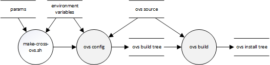

.. Copyright 2023 Intel Corporation
   SPDX-License-Identifier: Apache 2.0

=================
make-cross-ovs.sh
=================

Helper script to cross-compile and install Open vSwitch for the Arm Compute
Complex (ACC) of the Intel® IPU E2100.

Build flow
==========

Building and installing OVS is the first step in building P4 Control Plane
for the IPU E2100.

Once OVS is built, you can use the ``config-cross-recipe.sh`` script to
configure the next stage of the build, and the ``cmake`` command to compete it.

Syntax
======

.. code-block:: text

  ./scripts/es2k/make-cross-ovs.sh \
      [--help|-h]  \
      [--dry-run|-n] \
      [--build=BLDDIR | -B BLDDIR] \
      [--prefix=PREFIX | -P PREFIX] \
      [--toolchain=TOOLFILE | -T TOOLFILE ] \
      [--jobs=NJOBS | -j NJOBS]

Command-line parameters
=======================

General
-------

``--dry-run``, ``-n``
  Displays the parameters that will be passed to CMake, and exits.

``--help``, ``-h``
  Displays usage information and exits.

Paths
-----

``--build=BLDDIR``, ``-B BLDDIR``
  Directory that CMake will use to perform the build.
  Will be created if it does not exist.

  Specifies the value of the ``-B`` CMake option.
  Can be used to create separate build directories for native and
  cross-compiled builds.
  Defaults to ``ovs/build``.

``--prefix=PREFIX``, ``-P PREFIX`` *(see note)*
  Directory in which OVS will be installed.
  Will be created if it does not exist.

  Specifies the value of the ``CMAKE_INSTALL_PREFIX`` variable when
  building P4 Control Plane.
  Defaults to ``//opt/ovs``.

``--toolchain=FILE``, ``-T FILE``
  Path to the CMake toolchain file.

  Specifies the value of the ``CMAKE_TOOLCHAIN_FILE`` variable.
  Defaults to the value of the ``CMAKE_TOOLCHAIN_FILE`` environment
  variable.

.. note::
  ``//`` at the beginning of the directory path will be replaced with
  the *sysroot* directory path.

Options
-------

``--jobs=NJOBS``, ``-j NJOBS``
  Number of build threads.

  Specifies the value of the ``-j`` CMake option.
  Defaults to 8 threads.

Environment variables
=====================

``CMAKE_TOOLCHAIN_FILE``
  Path to the CMake toolchain file to be used.
  Specifies the value of the ``CMAKE_TOOLCHAIN_FILE`` variable.
  May be overridden by ``--toolchain=TOOLFILE``.
  Must be defined.

``SDKTARGETSYSROOT``
  Path to the system root (*sysroot*) directory for the ACC.
  Must be defined.
