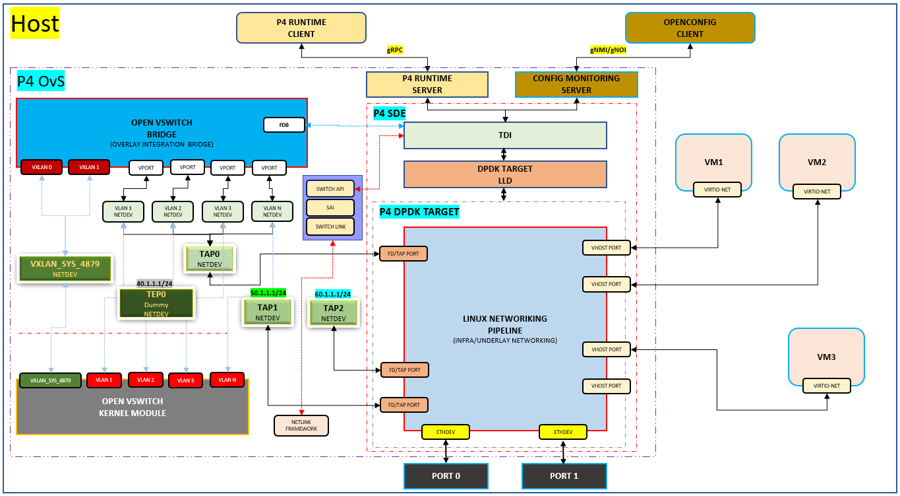

<!--
/*
 * Copyright (c) 2022 Intel Corporation.
 *
 * SPDX-License-Identifier: Apache-2.0
 *
 * Licensed under the Apache License, Version 2.0 (the "License");
 * you may not use this file except in compliance with the License.
 * You may obtain a copy of the License at:
 *
 * http://www.apache.org/licenses/LICENSE-2.0
 *
 * Unless required by applicable law or agreed to in writing, software
 * distributed under the License is distributed on an "AS IS" BASIS,
 * WITHOUT WARRANTIES OR CONDITIONS OF ANY KIND, either express or implied.
 * See the License for the specific language governing permissions and
 * limitations under the License.
 */
- -->

## Table of contents
1. [Overview](#overview)
2. [Topology](#topology)
3. [Create P4 artifacts](#create_p4_artifacts)
3. [Limitations](#limitations)
4. [Steps to create topology](#steps)

## Overview <a name="overview"></a>
This README describes a step by step procedure to run Linux networking scenario with ECMP enabled for underlay connectivity.

## Topology <a name="topology"></a>
<p align="center">
  
</p>


* Notes about topology:
  * VHOST ports, TAP ports, Physical LINK ports are created by GNMI CLI and LINK port is binded to the DPDK target
  * VLAN 1, VLAN 2, .... VLAN N created using Linux commands and are on top a TAP port. These VLAN ports should be equal to number of VM's that are spawned.
  * br-int, VxLAN0 ports are created using ovs-vsctl command provided by P4-OVS and all the VLAN ports are attached to br-int using ovs-vsctl command.
  * TEP port is of type dummy, created using ip utility command and this port is used as the VxLAN tunnel termination port.

System under test will have above topology running P4-OVS. Link Partner can have either P4-OVS or legacy OVS or kernel VxLAN. Both the Physical ports from System under test and Link Partner should be connected back to back. Note the limitations below before setting up the topology.

## Create P4 artifacts <a name="create_p4_artifacts"></a>
- Install p4c compiler from p4lang/p4c(<https://github.com/p4lang/p4c>) repository and follow the readme for procedure
- Set the environment variable OUTPUT_DIR to the location where artifacts should be generated and where p4 files are available
  eg. export OUTPUT_DIR=/root/ovs/p4proto/p4src/linux_networking/
- Generate the artifacts using p4c-dpdk installed in previous step using command below:
```
  p4c-dpdk --arch pna --target dpdk --p4runtime-files $OUTPUT_DIR/p4Info.txt --bf-rt-schema $OUTPUT_DIR/bf-rt.json --context $OUTPUT_DIR/context.json -o $OUTPUT_DIR/linux_networking.spec linux_networking.p4
```
- Modify sample lnw.conf file available in ovs/p4proto/p4src/linux_networking/ to specify absolute path of the artifacts (json and spec files)
- Generate binary execuatble using tdi-pipeline builder command below:
```
tdi_pipeline_builder --p4c_conf_file=lnw.conf --bf_pipeline_config_binary_file=lnw.pb.bin
```

## Limitations <a name="limitations"></a>
Current SAI enablement for P4-OVS has following limitations:
- Always all VHOST user ports need to be configured first and only then TAP ports/physical ports
- VM's Spawned on top of VHOST user ports should be UP and running, interfaces with in VM should be brought up before loading the "forwarding pipeline" (limitation by target)
- TAP port created for the corresponding link port should be created using "gnmi-ctl control port creation got the link port"
eg: gnmi-ctl set "device:physical-device,name:PORT0,pipeline-name:pipe,mempool-name:MEMPOOL0,control-port:TAP1,mtu:1500,pci-bdf:0000:18:00.0,packet-dir=network,port-type:link"
- All VLAN interfaces created on top of TAP ports, should always be in lowercase format "vlan+vlan_id"
Ex: vlan1, vlan2, vlan3 …. vlan4094
- br-int port, vxlan0 port and adding vlan ports to br-int need to be done after loading the pipeline.
- VxLAN destination port should always be standard port. i.e., 4789. (limitation by p4 parser)
- Only VNI 0 is supported.
- We are not supporting any ofproto rules which would not allow for FDB learning on OVS.
- Make sure underlay connectivity for both the nexthops is established before configuring multipath to reach the link partner.


## Steps to create the topology <a name="steps"></a>
#### 1. Bind the physical port (Port 0 and Port 1) to user-space IO driver:
* Load uio and vfio-pci driver
```
    modprobe uio
    modprobe vfio-pci
```
* Bind the devices to DPDK using dpdk-devbind.py script
```
    cd $SDE_INSTALL/bin
    ./dpdk-devbind.py --bind=vfio-pci <pci_bdf> eg: ./dpdk-devbind.py --bind=vfio-pci 0000:18:00.0
```
 *Note*: pci_bdf can be obtained using lspci command. Check if device is binded correctly using ./dpdk-devbind.py -s (Refer to the section "Network devices using DPDK-compatible driver")

#### 2. Export the environment variables and start running the OVS
```
    source p4ovs_env_setup.sh $SDE_INSTALL <$DEPS_INSTALL>
    ./run_ovs.sh <$DEPS_INSTALL>
```
#### 3. Create two VHOST user ports:
```
    gnmi-ctl set "device:virtual-device,name:net_vhost0,host-name:host1,device-type:VIRTIO_NET,queues:1,socket-path:/tmp/vhost-user-0,packet-dir:host,port-type:LINK"
    gnmi-ctl set "device:virtual-device,name:net_vhost1,host-name:host2,device-type:VIRTIO_NET,queues:1,socket-path:/tmp/vhost-user-1,packet-dir:host,port-type:LINK"
```

#### 4. Create two physical link ports with control port:
```
    gnmi-ctl set "device:physical-device,name:PORT0,control-port:TAP1,pci-bdf:0000:18:00.0,packet-dir:network,port-type:link"
    gnmi-ctl set "device:physical-device,name:PORT1,control-port:TAP2,pci-bdf:0000:18:00.1,packet-dir:network,port-type:link"

Note: Specify the pci-bdf of the devices binded to user-space in step 1. Corresponding control port for physical link port will be created if control port attribute is specified.
```

#### 5. Create two TAP ports:
```
    gnmi-ctl set "device:virtual-device,name:TAP0,pipeline-name:pipe,mempool-name:MEMPOOL0,mtu:1500,packet-dir:host,port-type:TAP"
    gnmi-ctl set "device:virtual-device,name:TAP3,pipeline-name:pipe,mempool-name:MEMPOOL0,mtu:1500,packet-dir:host,port-type:TAP"

Note:
    - Pkt-dir parameter is to specify the direction of traffic. It can take 2 values - host/network. Value 'host' specifies that traffic on this port will be internal(within the host). Value 'network' specifies that a particular port can receive traffic from network.
    - Ensure that no. of ports created should be power of 2 to satisfy DPDK requirements and when counting no. of ports, count control ports created along with physical link port(eg.: TAP1 and TAP2)
```
#### 6. Spawn two VM's on vhost-user ports created in step 3, start the VM's and assign IP's
```
    ip addr add 99.0.0.1/24 dev eth0
    ip link set dev eth0 up
    ip addr add 99.0.0.2/24 dev eth0
    ip link set dev eth0 up
```
#### 7. Configure tunnel termination port of type dummy
```
    ip link add dev TEP1 type dummy
```
#### 8. Bring up the TAP and dummy interfaces
```
    ip link set dev TAP0 up
    ip link set dev TAP1 up
    ip link set dev TAP2 up
    ip link set dev TAP3 up
    ip link set dev TEP1 up
```

#### 9. Set the pipeline and add br-int to OVS
```
    p4rt-ctl set-pipe br0 lnw.pb.bin p4Info.txt
    ovs-vsctl add-br br-int
    ip link set dev br-int up
```

#### 10. Configure VXLAN port
```
    ovs-vsctl add-port br-int vxlan1 -- set interface vxlan1 type=vxlan options:local_ip=40.1.1.1 options:remote_ip=30.1.1.1 options:dst_port=4789
Note:
    - VXLAN destination port should always be standard port. i.e., 4789. (limitation by p4 parser)
    - Remote IP is on another network and route to reach this can be configured statically (refer section 14.1) or dynamically learn via routing protocols supported by FRR (refer section 14.2)
```
#### 11. Configure VLAN ports on TAP0 and add them to br-int
```
    ip link add link TAP0 name vlan1 type vlan id 1
    ip link add link TAP0 name vlan2 type vlan id 2
    ovs-vsctl add-port br-int vlan1
    ovs-vsctl add-port br-int vlan2
    ip link set dev vlan1 up
    ip link set dev vlan2 up

Note:
     - All VLAN interfaces should be created on top of TAP ports, and should always be in lowercase format "vlan+vlan_id. (Eg: vlan1, vlan2, vlan3 …. vlan4094)
```

#### 12. Configure rules to push and pop VLAN from vhost 0 and 1 ports to TAP0 port (vhost-user and vlan port mapping)
```
Note: Port number used in p4rt-ctl commands are target datapath indexes(unique identifier for each port) which can be queried using following commands below. With current SDE implementation, both tdi-portin-id and tdi-portout-id are the same.

    gnmi-ctl get "device:virtual-device,name:net_vhost0,tdi-portin-id"
    gnmi-ctl get "device:virtual-device,name:net_vhost0,tdi-portout-id"

    Target DP index of control TAP port will be Target DP index of corresponding physical port + 1. If the ports are created in the order mentioned in the above step, target datapath indexes will be:

                   Port name          Target datapath index
                   vhost-user-0(VM1) - 0
                   vhost-user-1(VM2) - 1
                   phy-port0         - 2
                   TAP1              - 3
                   phy-port1         - 4
                   TAP2              - 5
                   TAP0              - 6
                   TAP3              - 7
```
 - **Rule for: Any tx control packet from VM1(TDP 0), pipeline should add a VLAN tag 1 and send it to TAP0 port(TDP 6)**
  ```
  p4rt-ctl add-entry br0 linux_networking_control.handle_tx_control_pkts_table "istd.input_port=0,action=linux_networking_control.push_vlan_fwd(6,1)"
  ```
 - **Rule for: Any tx control packet from VM2(TDP 1), pipeline should add a VLAN tag 2 and send it to TAP0 port(TDP 6)**
  ```
  p4rt-ctl add-entry br0 linux_networking_control.handle_tx_control_pkts_table "istd.input_port=1,action=linux_networking_control.push_vlan_fwd(6,2)"
  ```
 - **Rule for: Any tx control packet from TAP0 port(TDP 6) with VLAN tag 1, pipeline should pop the VLAN tag and send it to VM1(TDP 0)**
  ```
  p4rt-ctl add-entry br0 linux_networking_control.handle_tx_control_vlan_pkts_table "istd.input_port=6,local_metadata.vlan_id=1,action=linux_networking_control.pop_vlan_fwd(0)"
  ```

 - **Rule for: Any tx control packet from TAP0 port(TDP 6) with VLAN tag 2, pipeline should pop the VLAN tag and send it to VM2(TDP 1)**
  ```
  p4rt-ctl add-entry br0 linux_networking_control.handle_tx_control_vlan_pkts_table "istd.input_port=6,local_metadata.vlan_id=2,action=linux_networking_control.pop_vlan_fwd(1)"
  ```

#### 13. Configure rules for control packets coming in and out of physical port
  - **Rule for: Any rx control packet from phy port0(TDP 2) should be sent it to it corresponding control port TAP1(TDP 3)**
  ```
    p4rt-ctl add-entry br0 linux_networking_control.handle_rx_control_pkts_table "istd.input_port=2,action=linux_networking_control.set_control_dest(3)"
  ```

  - **Rule for: Any rx control packet from phy port1(TDP 4) should be sent it to it corresponding control port TAP2(TDP 5)**
  ```
    p4rt-ctl add-entry br0 linux_networking_control.handle_rx_control_pkts_table "istd.input_port=4,action=linux_networking_control.set_control_dest(5)"
  ```
  - **Rule for: Any tx control packet from control TAP1 port(TDP 3) should be sent it to it corresponding physical port phy port0(TDP 2)**
  ```
    p4rt-ctl add-entry br0 linux_networking_control.handle_tx_control_pkts_table "istd.input_port=3,action=linux_networking_control.set_control_dest(2)"
   ```
  - **Rule for: Any tx control packet from control TAP2 port(TDP 5) should be sent it to it corresponding physical port phy port1(TDP 4)**
  ```
    p4rt-ctl add-entry br0 linux_networking_control.handle_tx_control_pkts_table "istd.input_port=5,action=linux_networking_control.set_control_dest(4)"
  ```

#### 14. Configure ECMP for underlay connectivity
- **Rule for: To reach link partner multiple paths are configured, packets can be hashed to any port where the nexthop's ARP is learnt**
- **Nexthop is selected based on 5 tuple parameter. Which are source IPv4 address, destination IPv4 address, protocol type, UDP source port and UDP destination port of the overlay packet**
  - 14.1  Configure static routes.
    ```
    ip addr add 40.1.1.1/24 dev TEP1
    ip addr add 50.1.1.1/24 dev TAP1
    ip addr add 60.1.1.1/24 dev TAP2
    ip route add 30.1.1.1 nexthop via 50.1.1.2 dev TAP1 weight 1 nexthop via 60.1.1.2 dev TAP2 weight 1
    ```
#### 15. Test the ping scenarios:
  - Underlay ping for both ECMP nexthop's
  - Ping between VM's on the same host
  - Underlay ping for VxLAN tunnel termination port
  - Overlay ping: Ping between VM's on different hosts and validate hashing

